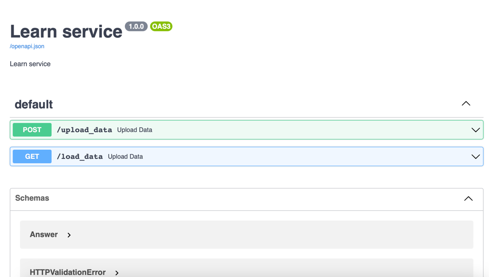

# Кластеризатор
Web сервис реализован в виде ful-REST приложения. 
На вход принимает .json с вложенными ключами: answer и count, на выход отдаёт.json обогащенный ключами: 

corrected - это скорректированное значение answer, корректировка орфографических ошибок, замена ненормативной лексики синонимами, приведение сокращений и аббревиатур в первоначальный виде. В этой модели использовали лемматизацию, нормализацию, предобученную языковую модель JamSpell;

sentiment - в этом поле мы определяем эмоциональный окрас значения из answer. Возможные значения: positive, negative, neutral. Использовали предобученную модель RuBERT-tiny2;

cluster - определяем кластер из значений corrected, при определении кластера так же определяем оптимальное кол-во кластеров для входящих данных. В этой модели использовали: предобученную модель BERT-Networks и фреймворк SentenceTransformers для построения эмбедингов, k-means для кластеризации, ti-idf для выделения названия кластера. Также используется алгоритмическое вычисление оптимального кол-ва кластеров;

interrupt - определяет законченность ответа, значение 1 - ответ закончен, 2 - ответ не закончен. Использовали эмбединги берта сжимали с помощью UMAP.

Из общих технологий: Docker, Python3.10, PostgreSql, Redis, OpenAI, FastAPI, React.


## Ссылка
```bash
http://158.160.31.78:2223/docs
```

## Запуск
```bash
git clone https://github.com/naginnn/hack2023.git

docker-compose up --build
```

## Swagger



## UI

...


